# WEB-LAB-6
<p align = "center">МИНИСТЕРСТВО НАУКИ И ВЫСШЕГО ОБРАЗОВАНИЯ<br>
РОССИЙСКОЙ ФЕДЕРАЦИИ<br>
ФЕДЕРАЛЬНОЕ ГОСУДАРСТВЕННОЕ БЮДЖЕТНОЕ<br>
ОБРАЗОВАТЕЛЬНОЕ УЧРЕЖДЕНИЕ ВЫСШЕГО ОБРАЗОВАНИЯ<br>
«САХАЛИНСКИЙ ГОСУДАРСТВЕННЫЙ УНИВЕРСИТЕТ»</p>
<br><br><br><br><br><br>
<p align = "center">Институт естественных наук и техносферной безопасности<br>Кафедра информатики<br>Шинкаренко Кирилл Константинович</p>
<br><br><br>
<p align = "center"><br><strong>Лабораторная работа №6.«CSS + JS CodeWars»</strong><br>01.03.02 Прикладная математика и информатика</p>
<br><br><br><br><br><br><br><br><br><br><br><br>
<p align = "right">Научный руководитель<br>
Соболев Евгений Игоревич</p>
<br><br><br>
<p align = "center">г. Южно-Сахалинск<br>2024 г.</p>
<br><br><br><br><br><br><br><br><br><br><br><br>

<h1 align = "center">Введение</h1>

<p><b>HTML</b> —  стандартизированный язык гипертекстовой разметки документов для просмотра веб-страниц в браузере. Веб-браузеры получают HTML документ от сервера по протоколам HTTP/HTTPS или открывают с локального диска, далее интерпретируют код в интерфейс, который будет отображаться на экране монитора.</p>
<p><b>CSS</b> — формальный язык описания внешнего вида документа, написанного с использованием языка разметки. Также может применяться к любым XML-документам, например, к SVG или XUL.</p>


<h1 style="text-align: center">Задачи CSS</h1>
<ol>
  <li>Придумайте селектор, который выберет абзацы &lt;p&gt; внутри дивов &lt;div&gt;.</li>
  <li>Придумайте селектор, который выберет все &lt;h2&gt; внутри дивов &lt;div&gt;.</li>
  <li>Придумайте селектор, который выберет все абзацы &lt;p&gt; из элемента с id=test.</li>
  <li>Придумайте селектор, который выберет все &lt;h2&gt; из элемента с id=test.</li>
  <li>Выберите все элементы с классом bbb.</li>
  <li>Выберите все элементы с классом bbb из элемента с id=test.</li>
  <li>Выберите все абзацы &lt;p&gt; с классом bbb.</li>
  <li>Выберите все &lt;h2&gt; с классом bbb.</li>
  <li>Выберите все абзацы &lt;p&gt; с классом bbb из элемента с id=test.</li>
  <li>Выберите все элементы с классом bbb и элементы с классом xxx одновременно.</li>
  <li>Выберите все абзацы &lt;p&gt; с классом bbb и &lt;h2&gt; с классом xxx одновременно.</li>
  <li>Выберите все абзацы &lt;p&gt; с классом bbb из id=test и все абзацы &lt;p&gt; с классом xxx из id=test одновременно.</li>
  <li>Выберите все элементы из класса fff.</li>
  <li>Выберите все абзацы &lt;p&gt; из класса fff.</li>
  <li>Выберите все абзацы &lt;p&gt; с классом fff.</li>
  <li>Выберите все элементы с классом bbb из класса fff.</li>
  <li>Выберите все &lt;h2&gt; с классом bbb из класса fff.</li>
  <li>Сделайте селектор, который выберет все ссылки из id=test, с состояния link и visited сделайте неподчеркнутыми и красными, а состояние hover - подчеркнутым и голубым.</li>
  <li>Сделайте селектор, который выберет все ссылки с классом www, состояния link и visited сделайте подчеркнутыми и голубыми, а состояние hover - неподчеркнутым.</li>
  <li>Сделайте селектор, который выберет все ссылки из id=test с классом www. Цвета состояний выберите самостоятельно.</li>
  <li>Сделайте селектор, который выберет все ссылки из class=eee с классом www. Цвета состояний выберите самостоятельно.</li>
  <li>Повторите страницу по данному по образцу:</li>
  <li>Повторите страницу по данному по образцу:</li>
  <li>Повторите страницу по данному по образцу:</li>
  <li>Повторите страницу по данному по образцу:</li>
  <li>Повторите страницу по данному по образцу:</li>
  <li>Повторите страницу по данному по образцу:</li>
  <li>Решить задачу на сайте https://www.codewars.com/kata/555de49a04b7d1c13c00000e</li>
  <li>Решить задачу на сайте https://www.codewars.com/kata/588453ea56daa4af920000ca</li>
  <li>Решить задачу на сайте https://www.codewars.com/kata/55e9529cbdc3b29d8c000016</li>
  <li>Решить задачу на сайте https://www.codewars.com/kata/55968ab32cf633c3f8000008</li>
  <li>Решить задачу на сайте https://www.codewars.com/kata/55ee3ebff71e82a30000006a</li>
  <li>Решить задачу на сайте https://www.codewars.com/kata/5412509bd436bd33920011bc</li>
</ol>


<h1 style="text-align: center">Решения CSS</h1>

<h2 style="text-align: center">Файлы 1 - 27.html</h2>

1
```html
<!DOCTYPE html>
<html lang="en">
<head>
    <meta charset="UTF-8">
    <meta name="viewport" content="width=device-width, initial-scale=1.0">
    <title>Document</title>
    <style>
        div p {
            color: red;
        }
    </style>
</head>
<body>
    <div>
        <p>Lorem ipsum dolor sit amet.</p>
        <p>Lorem ipsum dolor sit amet.</p>
        <p>Lorem ipsum dolor sit amet.</p>
        <p>Lorem ipsum dolor sit amet.</p>
        <p>Lorem ipsum dolor sit amet.</p>
    </div>

    <p>Lorem ipsum dolor sit amet.</p>
</body>
</html>
```

2
```html
<!DOCTYPE html>
<html lang="en">
<head>
    <meta charset="UTF-8">
    <meta name="viewport" content="width=device-width, initial-scale=1.0">
    <title>Document</title>
    <style>
        div h2 {
            color: blue;
        }
    </style>
</head>
<body>
    <div>
        <h2>hello</h2>
        <h2>hello</h2>
        <h2>hello</h2>
    </div>
    <h2>hello</h2>
</body>
</html>
```

3
```html
<!DOCTYPE html>
<html lang="en">
<head>
    <meta charset="UTF-8">
    <meta name="viewport" content="width=device-width, initial-scale=1.0">
    <title>Document</title>
    <style>
        #test p {
            color: red;
        }
    </style>
</head>
<body>
    <div id="test">
        <p>Lorem ipsum dolor sit amet.</p>
        <p>Lorem ipsum dolor sit amet.</p>
        <p>Lorem ipsum dolor sit amet.</p>
        <p>Lorem ipsum dolor sit amet.</p>
    </div>
    <p>Lorem ipsum dolor sit amet.</p>
</body>
</html>
```

4
```html
<!DOCTYh2E html>
<html lang="en">
<head>
    <meta charset="UTF-8">
    <meta name="viewh2ort" content="width=device-width, initial-scale=1.0">
    <title>Document</title>
    <style>
        #test h2 {
            color: red;
        }
    </style>
</head>
<body>
    <div id="test">
        <h2>Lorem ih2sum dolor sit amet.</h2>
        <h2>Lorem ih2sum dolor sit amet.</h2>
        <h2>Lorem ih2sum dolor sit amet.</h2>
        <h2>Lorem ih2sum dolor sit amet.</h2>
    </div>
    <h2>Lorem ih2sum dolor sit amet.</h2>
</body>
</html>
```

5
```html
<!DOCTYPE html>
<html lang="en">
<head>
    <meta charset="UTF-8">
    <meta name="viewport" content="width=device-width, initial-scale=1.0">
    <title>Document</title>
    <style>
        .bbb {
            color: blue;
        }
    </style>
</head>
<body>
    <div class="bbb">Lorem ipsum dolor sit amet.</div>
    <div class="bbb">Lorem ipsum dolor sit amet.</div>
    <div class="bbb">Lorem ipsum dolor sit amet.</div>
    <div class="bbb">Lorem ipsum dolor sit amet.</div>
</body>
</html>
```

6
```html
<!DOCTYPE html>
<html lang="en">
<head>
    <meta charset="UTF-8">
    <meta name="viewport" content="width=device-width, initial-scale=1.0">
    <title>Document</title>
    <style>
        #test .bbb {
            color: blue;
        }
    </style>
</head>
<body>
    <div id="test">
        <div class="bbb">Lorem ipsum dolor sit amet.</div>
        <div class="bbb">Lorem ipsum dolor sit amet.</div>
        <div class="bbb">Lorem ipsum dolor sit amet.</div>
    </div>

    <div class="bbb">Lorem ipsum dolor sit amet.</div>
</body>
</html>
```

7
```html
<!DOCTYPE html>
<html lang="en">
<head>
    <meta charset="UTF-8">
    <meta name="viewport" content="width=device-width, initial-scale=1.0">
    <title>Document</title>
    <style>
        .bbb {
            color: aqua;
        }
    </style>
</head>
<body>
    <p class="bbb">Lorem ipsum dolor sit amet.</p>
    <p class="bbb">Lorem ipsum dolor sit amet.</p>
    <p class="bbb">Lorem ipsum dolor sit amet.</p>
    <p class="bbb">Lorem ipsum dolor sit amet.</p>

    <p>Lorem ipsum dolor sit amet.</p>
</body>

</html>
```

8
```html
<!DOCTYh2E html>
<html lang="en">
<head>
    <meta charset="UTF-8">
    <meta name="viewh2ort" content="width=device-width, initial-scale=1.0">
    <title>Document</title>
    <style>
        .bbb {
            color: aqua;
        }
    </style>
</head>
<body>
    <h2 class="bbb">Lorem ih2sum dolor sit amet.</h2>
    <h2 class="bbb">Lorem ih2sum dolor sit amet.</h2>
    <h2 class="bbb">Lorem ih2sum dolor sit amet.</h2>
    <h2 class="bbb">Lorem ih2sum dolor sit amet.</h2>

    <h2>Lorem ih2sum dolor sit amet.</h2>
</body>

</html>
```

9
```html
<!DOCTYPE html>
<html lang="en">
<head>
    <meta charset="UTF-8">
    <meta name="viewport" content="width=device-width, initial-scale=1.0">
    <title>Document</title>
    <style>
        #test .bbb {
            color: blue;
        }
    </style>
</head>
<body>
    <div id="test">
        <p class="bbb">Lorem ipsum dolor sit amet.</p>
        <p class="bbb">Lorem ipsum dolor sit amet.</p>
        <p class="bbb">Lorem ipsum dolor sit amet.</p>
    </div>

    <p class="bbb">Lorem ipsum dolor sit amet.</p>
</body>
</html>
```

10
```html
<!DOCTYPE html>
<html lang="en">
<head>
    <meta charset="UTF-8">
    <meta name="viewport" content="width=device-width, initial-scale=1.0">
    <title>Document</title>
    <style>
        .bbb, .xxx {
            color: blue;
        }
    </style>
</head>
<body>
    <div class="bbb">Lorem ipsum dolor sit amet.</div>
    <div class="bbb">Lorem ipsum dolor sit amet.</div>
    <div class="bbb">Lorem ipsum dolor sit amet.</div>

    <div class="xxx">Lorem, ipsum.</div>
    <div class="xxx">Lorem, ipsum.</div>
    <div class="xxx">Lorem, ipsum.</div>
</body>
</html>
```

11
```html
<!DOCTYPE html>
<html lang="en">
<head>
    <meta charset="UTF-8">
    <meta name="viewport" content="width=device-width, initial-scale=1.0">
    <title>Document</title>
    <style>
        .bbb, .xxx {
            color: blue;
        }
    </style>
</head>
<body>
    <h2 class="bbb">Lorem ipsum dolor sit amet.</h2>
    <h2 class="bbb">Lorem ipsum dolor sit amet.</h2>
    <h2 class="bbb">Lorem ipsum dolor sit amet.</h2>

    <p class="xxx">Lorem, ipsum.</p>
    <p class="xxx">Lorem, ipsum.</p>
    <p class="xxx">Lorem, ipsum.</p>
</body>
</html>
```

12
```html
<!DOCTYPE html>
<html lang="en">
<head>
    <meta charset="UTF-8">
    <meta name="viewport" content="width=device-width, initial-scale=1.0">
    <title>Document</title>
    <style>
        #test .bbb, #test .xxx {
            color: red;
        }
    </style>
</head>
<body>
    <div id="test">
        <p class="bbb">Lorem, ipsum dolor.</p>
        <p class="bbb">Lorem, ipsum dolor.</p>
        <p class="bbb">Lorem, ipsum dolor.</p>

        <p class="xxx">Lorem ipsum dolor sit amet.</p>
        <p class="xxx">Lorem ipsum dolor sit amet.</p>
        <p class="xxx">Lorem ipsum dolor sit amet.</p>
    </div>
</body>
</html>
```

13
```html
<!DOCTYPE html>
<html lang="en">
<head>
    <meta charset="UTF-8">
    <meta name="viewport" content="width=device-width, initial-scale=1.0">
    <title>Document</title>
    <style>
        .fff * {
            color: grey;
            font-size: 18px;
        }
    </style>
</head>
<body>
    <div class="fff">
        <p>Lorem ipsum dolor sit amet.</p>
        <p>Lorem ipsum dolor sit amet.</p>
        <p>Lorem ipsum dolor sit amet.</p>
        <h1>Lorem, ipsum dolor.</h1>
    </div>
</body>
</html>
```

14
```html
<!DOCTYPE html>
<html lang="en">
<head>
    <meta charset="UTF-8">
    <meta name="viewport" content="width=device-width, initial-scale=1.0">
    <title>Document</title>
    <style>
        .fff p {
            color: red;
        }
    </style>
</head>
<body>
    <div class="fff">
        <p>Lorem, ipsum dolor.</p>
        <p>Lorem, ipsum dolor.</p>
        <p>Lorem, ipsum dolor.</p>
        <p>Lorem, ipsum dolor.</p>
    </div>

    <p>Lorem ipsum dolor sit amet.</p>
</body>
</html>
```

15
```html
<!DOCTYPE html>
<html lang="en">
<head>
    <meta charset="UTF-8">
    <meta name="viewport" content="width=device-width, initial-scale=1.0">
    <title>Document</title>
    <style>
        .fff {
            color: red;
        }
    </style>
</head>
<body>
    <p class="fff">Lorem ipsum dolor sit amet.</p>
    <p class="fff">Lorem ipsum dolor sit amet.</p>
    <p class="fff">Lorem ipsum dolor sit amet.</p>

    <p>Lorem, ipsum dolor.</p>
</body>
</html>
```

16
```html
<!DOCTYPE html>
<html lang="en">
<head>
    <meta charset="UTF-8">
    <meta name="viewport" content="width=device-width, initial-scale=1.0">
    <title>Document</title>
    <style>
        .fff .bbb {
            color: red;
        }
    </style>
</head>
<body>
    <div class="fff">
        <p class="bbb">Lorem ipsum dolor sit amet.</p>
        <p class="bbb">Lorem ipsum dolor sit amet.</p>
        <p class="bbb">Lorem ipsum dolor sit amet.</p>
        <p>Lorem, ipsum dolor.</p>
    </div>
</body>
</html>
```

17
```html
<!DOCTYh2E html>
<html lang="en">
<head>
    <meta charset="UTF-8">
    <meta name="viewh2ort" content="width=device-width, initial-scale=1.0">
    <title>Document</title>
    <style>
        .fff .bbb {
            color: red;
        }
    </style>
</head>
<body>
    <div class="fff">
        <h2 class="bbb">Lorem ih2sum dolor sit amet.</h2>
        <h2 class="bbb">Lorem ih2sum dolor sit amet.</h2>
        <h2 class="bbb">Lorem ih2sum dolor sit amet.</h2>
        <h2>Lorem, ih2sum dolor.</h2>
    </div>
</body>
</html>
```

18
```html
<!DOCTYPE html>
<html lang="en">
<head>
    <meta charset="UTF-8">
    <meta name="viewport" content="width=device-width, initial-scale=1.0">
    <title>Document</title>
    <style>
        #test a:link, #test a:visited {
            text-decoration: none;
            color: red;
        } 

        #test a:hover {
            text-decoration: underline;
            color: blue;
        } 
    </style>
</head>
<body>
    <div id="test">
        <a href="">link</a>
        <a href="">link</a>
        <a href="">link</a>
        <a href="">link</a>
    </div>
</body>
</html>
```

19
```html
<!DOCTYPE html>
<html lang="en">
<head>
    <meta charset="UTF-8">
    <meta name="viewport" content="width=device-width, initial-scale=1.0">
    <title>Document</title>
    <style>
        .www:link, .www:visited {
            text-decoration: underline;
            color: blue;
        } 

        .www:hover {
            text-decoration: none;
        } 
    </style>
</head>
<body>
    <a class="www" href="">link</a>
    <a class="www" href="">link</a>
    <a class="www" href="">link</a>
    <a class="www" href="">link</a>
</body>
</html>
```

20
```html
<!DOCTYPE html>
<html lang="en">
<head>
    <meta charset="UTF-8">
    <meta name="viewport" content="width=device-width, initial-scale=1.0">
    <title>Document</title>
    <style>
        #test .www:link, #test .www:visited {
            text-decoration: none;
            color: red;
        } 

        #test .www:hover {
            text-decoration: underline;
            color: blue;
        } 
    </style>
</head>
<body>
    <div id="test">
        <a class="www" href="">link</a>
        <a class="www" href="">link</a>
        <a class="www" href="">link</a>
        <a class="www" href="">link</a>
    </div>
</body>
</html>
```

21
```html
<!DOCTYPE html>
<html lang="en">
<head>
    <meta charset="UTF-8">
    <meta name="viewport" content="width=device-width, initial-scale=1.0">
    <title>Document</title>
    <style>
        .eee .www:link, .eee .www:visited {
            text-decoration: none;
            color: red;
        } 

        .eee .www:hover {
            text-decoration: underline;
            color: blue;
        } 
    </style>
</head>
<body>
    <div class="eee">
        <a class="www" href="">link</a>
        <a class="www" href="">link</a>
        <a class="www" href="">link</a>
        <a class="www" href="">link</a>
    </div>
</body>
</html>
```

22
```html
<!DOCTYPE html>
<html lang="en">
<head>
    <meta charset="UTF-8">
    <title>Title</title>
    <style>
        body {
            border-style: dotted;
            border-color: black;
        }

        .underline {
            text-decoration: underline;
        }

        .strike {
            text-decoration: line-through;
            text-decoration-color: black;
            text-decoration-thickness: 2px;
        }

        .overline {
            text-decoration: overline;
            text-decoration-color: black;
            text-decoration-thickness: 2px;
        }
    </style>
</head>
<body>
    <p class="underline">Привет, мир!</p>
    <p class="strike">Привет, мир!</p>
    <p class="overline">Привет, мир!</p>
</body>
</html>
```

23
```html
<!DOCTYPE html>
<html lang="en">
<head>
    <meta charset="UTF-8">
    <title>Title</title>
    <style>
        body {
            border-style: dotted;
            border-color: gray;
        }
        .square {
            border: solid 1px red;
            width: 300px;
            height: 300px;
            margin: 20px;
        }
    </style>
</head>
<body>
    <div class="square"></div>
</body>
</html>
```

24
```html
<!DOCTYPE html>
<html lang="en">
<head>
    <meta charset="UTF-8">
    <title>Title</title>
    <style>
        body {
            border-style: dotted;
            border-color: gray;
        }
        .square {
            border: dotted 1px blue;
            width: 400px;
            height: 200px;
            margin: 10px;
        }
    </style>
</head>
<body>
<div class="square"></div>
</body>
</html>
```

25
```html
<!DOCTYPE html>
<html lang="en">
<head>
    <meta charset="UTF-8">
    <title>Title</title>
    <style>
        body {
            border-style: dotted;
            border-color: gray;
        }
        .square {
            border: dotted 1px green;
            width: 350px;
            height: 350px;
            margin: 10px;
            border-radius: 10px 30px;
        }
    </style>
</head>
<body>
<div class="square"></div>
</body>
</html>
```

26
```html
<!DOCTYPE html>
<html lang="en">
<head>
    <meta charset="UTF-8">
    <title>Title</title>
    <style>
        body {
            border-style: dotted;
            border-color: gray;
        }
        .round {
            border: solid 1px red;
            width: 100px;
            height: 100px;
            margin: 10px;
            border-radius: 50%;
        }
    </style>
</head>
<body>
<div class="round"></div>
</body>
</html>
```

27
```html
<!DOCTYPE html>
<html lang="en">
<head>
    <meta charset="UTF-8">
    <title>Title</title>
    <style>
        body {
            border-style: dotted;
            border-color: gray;
        }
        .underline {
            text-decoration: underline;
        }

        .green {
            color: green;
        }

        .red {
            color: red;
        }

        .black {
            color: black;
            text-decoration: none;
        }
    </style>
</head>
<body>
<div style="display: flex;flex-direction: column; margin: 20px; gap:20px;">
    <a href="#" class="underline green">cсылка</a>
    <a href="#" class="underline red">cсылка</a>
    <a href="#" class="black">cсылка</a>
</div>

</body>
</html>
```


<h1 align = "center">Результат HTML</h1>

<ol>
  <li>
    <div style="display: flex; flex-direction: column">
        <div>Придумайте селектор, который выберет абзацы &lt;p&gt; внутри дивов &lt;div&gt;.</div>
        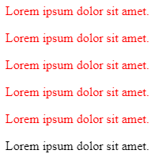
    </div>
  </li>
  <li>
    <div style="display: flex; flex-direction: column">
        <div>Придумайте селектор, который выберет все &lt;h2&gt; внутри дивов &lt;div&gt;.</div>
        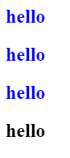
    </div>
  </li>
  <li>
    <div style="display: flex; flex-direction: column">
        <div>Придумайте селектор, который выберет все абзацы &lt;p&gt; из элемента с id=test.</div>
        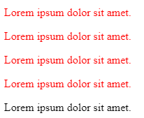
    </div>
  </li>
  <li>
    <div style="display: flex; flex-direction: column">
        <div>Придумайте селектор, который выберет все &lt;h2&gt; из элемента с id=test.</div>
        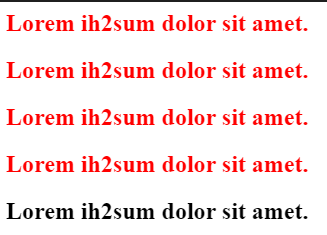
    </div>
  </li>
  <li>
    <div style="display: flex; flex-direction: column">
        <div>Выберите все элементы с классом bbb.</div>
        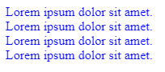
    </div>
  </li>
  <li>
    <div style="display: flex; flex-direction: column">
        <div>Выберите все элементы с классом bbb из элемента с id=test.</div>
        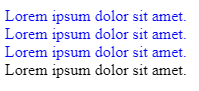
    </div>
  </li>
  <li>
    <div style="display: flex; flex-direction: column">
        <div>Выберите все абзацы &lt;p&gt; с классом bbb.</div>
        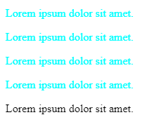
    </div>
  </li>
  <li>
    <div style="display: flex; flex-direction: column">
        <div> Выберите все &lt;h2&gt; с классом bbb.</div>
        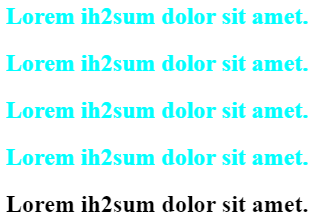
    </div>
  </li>
  <li>
    <div style="display: flex; flex-direction: column">
        <div>Выберите все абзацы &lt;p&gt; с классом bbb из элемента с id=test.</div>
        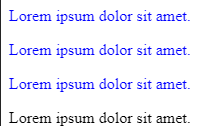
    </div>
  </li>
  <li>
    <div style="display: flex; flex-direction: column">
        <div>Выберите все элементы с классом bbb и элементы с классом xxx одновременно.</div>
        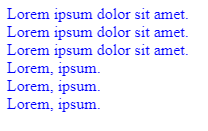
    </div>
  </li>
  <li>
    <div style="display: flex; flex-direction: column">
        <div>Выберите все абзацы &lt;p&gt; с классом bbb и &lt;h2&gt; с классом xxx одновременно.</div>
        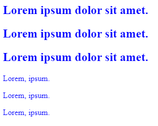
    </div>
  </li>
  <li>
    <div style="display: flex; flex-direction: column">
        <div>Выберите все абзацы &lt;p&gt; с классом bbb из id=test и все абзацы &lt;p&gt; с классом xxx из id=test одновременно.</div>
        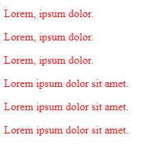
    </div>
  </li>
  <li>
    <div style="display: flex; flex-direction: column">
        <div>Выберите все элементы из класса fff.</div>
        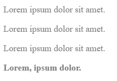
    </div>
  </li>
  <li>
    <div style="display: flex; flex-direction: column">
        <div>Выберите все абзацы &lt;p&gt; из класса fff.</div>
        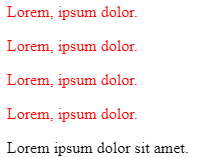
    </div>
  </li>
  <li>
    <div style="display: flex; flex-direction: column">
        <div>Выберите все абзацы &lt;p&gt; с классом fff.</div>
        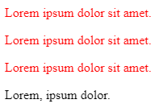
    </div>
  </li>
  <li>
    <div style="display: flex; flex-direction: column">
        <div>Выберите все элементы с классом bbb из класса fff.</div>
        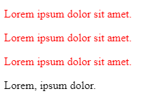
    </div>
  </li>
  <li>
    <div style="display: flex; flex-direction: column">
        <div>Выберите все &lt;h2&gt; с классом bbb из класса fff.</div>
        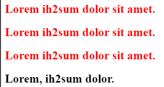
    </div>
  </li>
  <li>
    <div style="display: flex; flex-direction: column">
        <div>Сделайте селектор, который выберет все ссылки из id=test, с состояния link и visited сделайте неподчеркнутыми и красными, а состояние hover - подчеркнутым и голубым.</div>
        
    </div>
  </li>
  <li>
    <div style="display: flex; flex-direction: column">
        <div>Сделайте селектор, который выберет все ссылки с классом www, состояния link и visited сделайте подчеркнутыми и голубыми, а состояние hover - неподчеркнутым.</div>
        
    </div>
  </li>
  <li>
    <div style="display: flex; flex-direction: column">
        <div>Сделайте селектор, который выберет все ссылки из id=test с классом www. Цвета состояний выберите самостоятельно.</div>
        
    </div>
  </li>
  <li>
    <div style="display: flex; flex-direction: column">
        <div>Сделайте селектор, который выберет все ссылки из class=eee с классом www. Цвета состояний выберите самостоятельно.</div>
        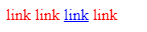
    </div>
  </li>
  <li>
    <div style="display: flex; flex-direction: column">
        <div> Повторите страницу по данному по образцу:</div>
        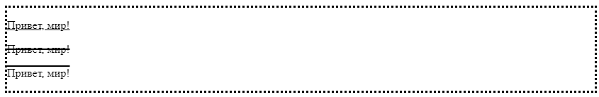
    </div>
  </li>
  <li>
    <div style="display: flex; flex-direction: column">
        <div>Повторите страницу по данному по образцу:</div>
        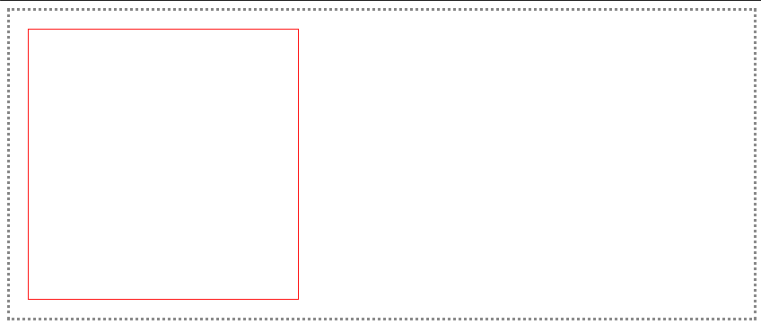
    </div>
  </li>
  <li>
    <div style="display: flex; flex-direction: column">
        <div>Повторите страницу по данному по образцу:</div>
        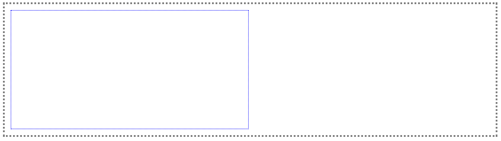
    </div>
  </li>
  <li>
    <div style="display: flex; flex-direction: column">
        <div>Повторите страницу по данному по образцу:</div>
        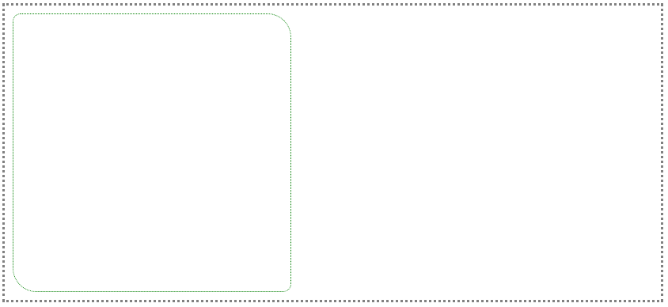
    </div>
  </li>
  <li>
    <div style="display: flex; flex-direction: column">
        <div>Повторите страницу по данному по образцу:</div>
        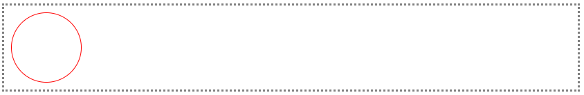
    </div>
  </li>
  <li>
    <div style="display: flex; flex-direction: column">
        <div>Повторите страницу по данному по образцу:</div>
        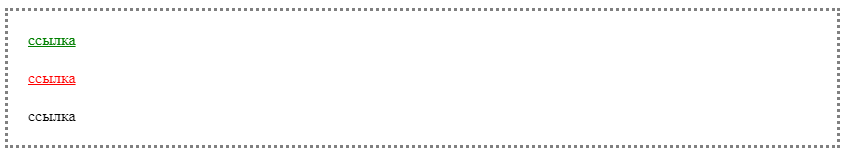
    </div>
  </li>
<li>
    <div style="display: flex; flex-direction: column">
        <div>Решить задачу на сайте https://www.codewars.com/kata/555de49a04b7d1c13c00000e</div>
        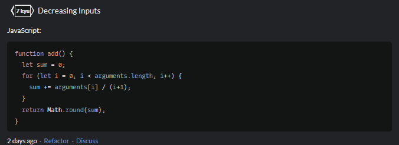
    </div>
  </li>
<li>
    <div style="display: flex; flex-direction: column">
        <div>Решить задачу на сайте https://www.codewars.com/kata/588453ea56daa4af920000ca</div>
        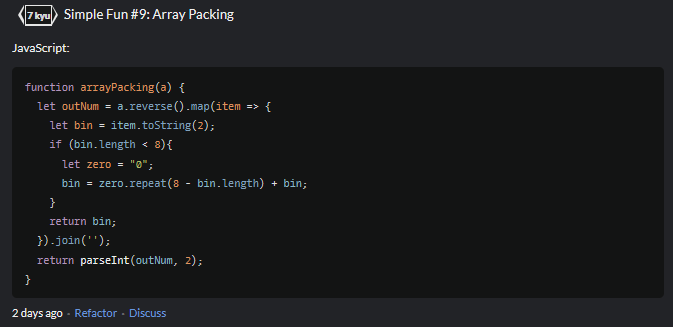
    </div>
  </li>
<li>
    <div style="display: flex; flex-direction: column">
        <div>Решить задачу на сайте https://www.codewars.com/kata/55e9529cbdc3b29d8c000016</div>
        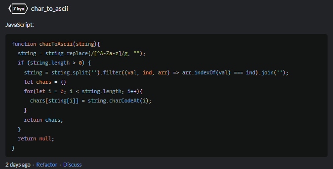
    </div>
  </li>
<li>
    <div style="display: flex; flex-direction: column">
        <div>Решить задачу на сайте https://www.codewars.com/kata/55968ab32cf633c3f8000008</div>
        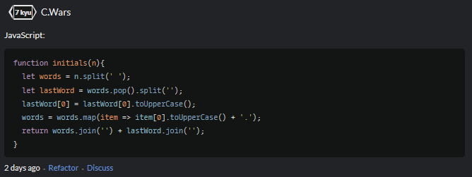
    </div>
  </li>
<li>
    <div style="display: flex; flex-direction: column">
        <div>Решить задачу на сайте https://www.codewars.com/kata/55ee3ebff71e82a30000006a</div>
        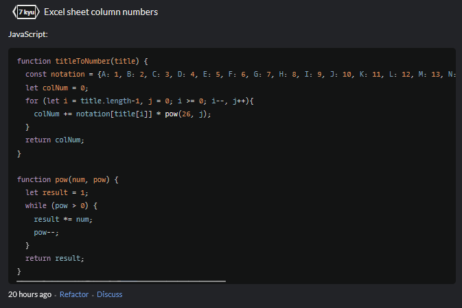
    </div>
  </li>
<li>
    <div style="display: flex; flex-direction: column">
        <div>Решить задачу на сайте https://www.codewars.com/kata/5412509bd436bd33920011bc</div>
        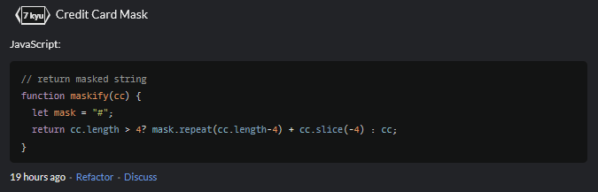
    </div>
  </li>
</ol>

<h1 align = "center">Вывод</h1>
<p>В ходе выполнения лабораторной работы по CSS были рассмотрены различные селекторы, которые позволяют выбирать и стилизовать определенные элементы на веб-странице + решены 6 задачек на CodeWars на языке JS.</p>
